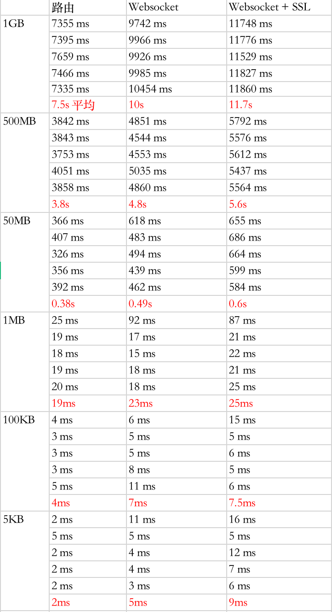

# 四层转发与七层转发时间消耗比较

越高的层次，由于需要解析数据包的部分变多了，所以转发的性能就会有所降低，这里做了一个简单的实验，测试了一下对于不同方式，多个节点转发一个数据包所花费的时间，注意两点：1. 只测试了时间 2. 只需要处理一个转发请求

<!-- more -->

## 转发定义

四层转发仅仅是利用 Iptables 配置 NAT 的相关条目来转发数据包。

七层转发不是简单的 HTTP Proxy，而是利用 WebSocket 的长连接进行数据传输，这样子就省去了传输数据开始时的 TCP 三次握手。

---

## 测试类型

第一种，节点仅仅作为一个路由器转发，通过 < srcIP , srcPort , destIP , destPort  > 来识别数据包，由内核对数据包进行转发操作。

第二种，事先在不同路由节点间使用 WebSocket 连接（一个应用层协议，可以在两个节点间建立起长连接），在传输数据包所用到的应用层协议中添加ID来标识数据包，使用 Websocket 建立的长连接在不同节点间传输该数据包。也就是说操作是在应用层完成的，存在用户态内核态切换、数据解析等方面的性能损耗。

第三种和第二种一样，只不过额外为 WebSocket 添加了 SSL/TLS 数据加密。

---

## 测试环境和测试内容

在传输路径中，中间作为路由的节点有6个，最终处理数据（仅仅将接收的数据存储在本地）的节点1个。这7个节点都是运行在本机上的 Linux 虚拟机，每个分配了2G内存、2核CPU。

分别传输了 5KB、100KB、1MB、50MB、500MB、1GB 的数据，每种测了5次，统计了完成任务的用时。

---

## 测试结果

[网络路由测试数据.xlsx](网络路由测试数据.xlsx)

---

## 测试使用代码

[schwarzeni/network-forward-survey](https://github.com/schwarzeni/network-forward-survey)

至于能不能在别的机子上跑我就不知道了
